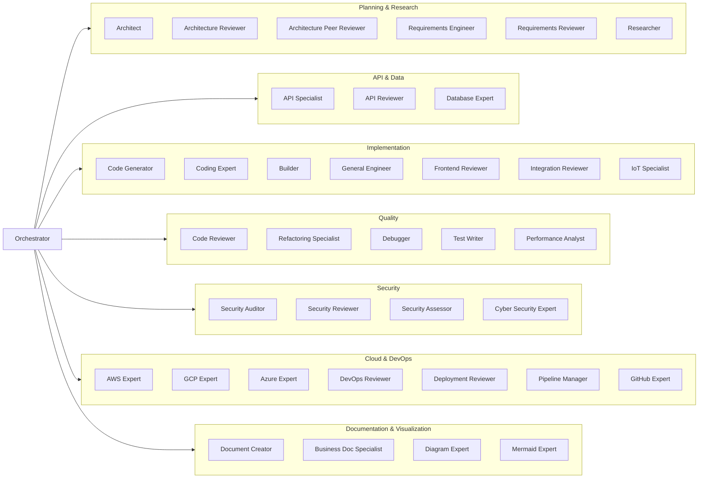

# AI Developer Agents


A production-ready suite of 14 specialized AI software engineering subagents for orchestrating complex development workflows. Each agent is a self-contained, markdown-defined prompt optimized for use in AI IDEs and chat tools.

## What is This?

Imagine you have a big software project to build—like a website, a mobile app, or a backend API. Normally, you'd need a whole team: an architect to design the system, a developer to write code, a tester to check for bugs, a security expert to lock it down, a DevOps engineer to deploy it, and more.

This repository gives you that entire team—as AI prompts you can load into tools like GitHub Copilot, Cline, Cursor, Claude Projects, ChatGPT, Kilo, and Windsurf. Each "agent" is a specialized AI persona with expert knowledge in a specific domain. You talk to the **Orchestrator** (the team lead), and it automatically delegates tasks to the right specialists, then combines their work into a final result.

## Core Features

- **Orchestrator + Subagents Model**: A central Orchestrator decomposes tasks and dispatches them to specialized subagents, then synthesizes their outputs into a unified deliverable.
- **20+ Specialized Agents**: Covering the full SDLC—architecture, implementation, testing, documentation, review, security, DevOps, performance, IoT, integration, debugging, refactoring, business communication, and a general-purpose solo engineer.
- **IDE-Agnostic Prompts**: Markdown-based agent definitions load directly into GitHub Copilot, Cline, Cursor, Claude Projects, ChatGPT, Kilo, Windsurf, and similar tools.
- **CI Validation**: Automated linting and validation of agent definitions on every PR.
- **Extensible**: Add custom agents by following the established schema and conventions.

## How It Works — Simple Explanation

### What is an "Agent"?
An agent is a file (`.md`) that tells an AI tool how to behave in a specific role. It's like giving the AI a job description and expertise before it starts helping you. For example:
- The **Code Reviewer** agent knows how to spot bugs, security issues, and bad code patterns.
- The **Database Expert** agent knows how to design efficient database schemas.
- The **Security Auditor** agent knows how to find vulnerabilities and fix them.

### What is the "Orchestrator"?
The Orchestrator is the "project manager" agent. When you give it a big task like *"Build a REST API with authentication"*, it:
1. Breaks the task into smaller pieces (design, code, test, secure, deploy)
2. Sends each piece to the right specialist agent
3. Collects all the results
4. Combines them into a complete, working solution

### Why Use Multiple Agents?
Specialized AI agents produce better results than a single general-purpose AI because each agent has deep, focused expertise in its domain. Just like a real software team, specialists collaborate to build high-quality software.

## Architecture Overview

The system follows a **hub-and-spoke architecture**:



The **Orchestrator** receives high-level user tasks, decomposes them into discrete subtasks, dispatches each to the most appropriate agent, and synthesizes the results into a final deliverable. This enables complex, end-to-end workflows while maintaining specialization and quality.

## Agent Directory

| Filename | Role | Typical Input | Typical Output |
|----------|------|--------------|----------------|
| `orchestrator.md` | Central task coordinator and synthesizer | High-level task description | Integrated final deliverable with summary |
| `general_engineer.md` | End-to-end solo engineer for any task | Task description, existing code | Complete solution: code, tests, docs, deployment |
| `debugger.md` | Root cause analysis and minimal bug fixes | Bug description, stack traces, logs | Root cause, minimal fix, prevention tests |
| `refactoring_specialist.md` | Legacy code modernization and debt reduction | Code to refactor, pain points | Refactoring plan, safe changes, test coverage |
| `cyber_security_expert.md` | Offensive security, pentesting, threat hunting, hardening | Scope, architecture, code, configs | Security assessment, exploits, remediation plan |
| `business_documentation_specialist.md` | Marketing, sales docs, PPTs, presentations, content scraping | Source material, audience, format | Business docs, slide decks, transformed content |
| `api_specialist.md` | Validates OpenAPI specs and API design | API endpoints, OpenAPI YAML/JSON | API assessment with consistency score and recommendations |
| `architecture_reviewer.md` | Evaluates system design, scalability, reliability | HLD/LLD, architecture diagrams | Assessment report with trade-offs and recommendations |
| `code_reviewer.md` | Reviews code for quality, bugs, and security | PR diffs, source code | Structured review with severity-ranked findings and fixes |
| `database_expert.md` | Designs schemas and optimizes queries | SQL schema, ORM models, query code | Schema definitions, migration scripts, index recommendations |
| `developer_agent.md` | Generates production-ready code implementations | Requirements, existing code examples | Production-ready code with design decisions and testing strategy |
| `devops_reviewer.md` | Reviews infrastructure, CI/CD, and deployments | Dockerfiles, K8s manifests, Terraform | Infrastructure maturity assessment with automation opportunities |
| `document_creator.md` | Generates HLD, LLD, and API specifications | Requirements, architecture notes | Structured technical documents with full traceability |
| `frontend_reviewer.md` | Reviews UI/UX, accessibility, and frontend code | HTML, CSS, JS/TS, React/Vue components | Frontend quality assessment with UX and accessibility findings |
| `integration_reviewer.md` | Reviews system integrations and middleware | Architecture diagrams, event schemas, integration code | Integration maturity assessment with coupling and observability analysis |
| `iot_protocol_specialist.md` | Reviews IoT architectures and protocol implementations | IoT architecture, MQTT/OPCUA/Modbus configs | Protocol analysis with edge processing and reliability recommendations |
| `performance_analyst.md` | Analyzes performance bottlenecks and scalability | Code, architecture, API implementations | Performance baselines, bottlenecks, and load testing scenarios |
| `security_auditor.md` | Audits security posture and compliance gaps | Architecture, code, deployment configs | Threat landscape, vulnerabilities, and prioritized remediations |
| `test_writer.md` | Generates comprehensive test scenarios and cases | Requirements, API specs, feature details | Test cases, edge cases, negative scenarios, and automation suggestions |

## Quickstart

### Step 1: Clone the Repository

```bash
git clone https://github.com/nimish-nirmal/ai-developer-agents.git
cd ai-developer-agents
```

### Step 2: Minimal Agent Config Examples

#### GitHub Copilot Chat

```text
# .github/copilot-instructions.md
# Paste the full contents of agents/orchestrator.md here
```

#### Cline

```text
# .cline/instructions.md
# Paste the full contents of agents/orchestrator.md here
```

#### Cursor

```text
# .cursor/rules/orchestrator.md
# Paste the full contents of agents/orchestrator.md here
```

#### Claude Projects

```text
# Project Instructions
# Paste the full contents of agents/orchestrator.md here
```

#### ChatGPT Custom GPTs

```text
# Instructions field
# Paste the full contents of agents/orchestrator.md here
```

#### Kilo

```text
# .kilo/rules/orchestrator.md
# Paste the full contents of agents/orchestrator.md here
```

#### Windsurf

```text
# .windsurf/rules/orchestrator.md
# Paste the full contents of agents/orchestrator.md here
```

### Step 3: Run a Task

```text
User: Build a REST API with authentication.
Assistant: Uses the loaded orchestrator to dispatch architecture, coding, testing, review, security, and deployment work, then returns one integrated result.
```

### Step 4: Validation

```bash
python scripts/validate_agents.py
```

### Step 2: Load Agents into Your IDE

Each agent is a standalone markdown file. Load them into your preferred AI tool:

#### GitHub Copilot Chat

1. In your repository, create a `.github/copilot-instructions.md` file.
2. Paste the agent system prompt content into this file.
3. Copilot will use this as project-wide context.

#### Cline

1. Open Cline in VS Code.
2. Create a `.cline/instructions.md` file or open Cline settings.
3. Paste the agent contents.
4. Cline will use these instructions for the session.

#### Cursor

1. Open your project in Cursor.
2. Create a `.cursor/rules/` directory (if it doesn't exist).
3. Copy the desired agent `.md` files into `.cursor/rules/`.
4. Cursor will automatically detect and load these rules.

#### Claude Projects

1. Go to [Claude Projects](https://claude.ai/projects).
2. Create a new project.
3. Upload or paste the agent markdown files as project knowledge.
4. Select the appropriate agent as the system prompt for your conversation.

#### ChatGPT Custom GPTs

1. Go to [GPT Store](https://chat.openai.com/gpts) or create a Custom GPT.
2. In the "Instructions" field, paste the contents of the desired agent `.md` file.
3. Optionally upload supporting files from the `examples/` directory.

#### Kilo

1. Open Kilo.
2. In the chat input, use the `/agent` command or paste the agent contents directly.
3. Provide your task.

#### Windsurf

1. Open your project in Windsurf.
2. Navigate to `.windsurf/rules/`.
3. Place agent `.md` files there for automatic loading.

### Step 3: Run a Workflow

The Orchestrator agent is the entry point. Copy the contents of `agents/orchestrator.md` into your AI tool's system prompt or instructions, then provide your high-level task.

Example interaction:

```
User: Build a REST API for a task management app with authentication, tests, and documentation.

Orchestrator: I'll decompose this into subtasks and dispatch them to the appropriate agents...

[Dispatches to architecture-reviewer, api-specialist, developer-agent, database-expert, test-writer, document-creator, code-reviewer, security-auditor, devops-reviewer, performance-analyst]

Orchestrator: Here is the integrated final deliverable...
```

## Example End-to-End Workflows

### Workflow 1: User Authentication Microservice

**Input**
> **User:** "Build a user authentication microservice with JWT, rate limiting, and PostgreSQL."

**Orchestrator Execution**

1. **Decompose** the task:
   - Design microservice architecture (`architecture_reviewer`)
   - Validate API design (`api_specialist`)
   - Implement auth service (`developer_agent`)
   - Design database schema (`database_expert`)
   - Generate comprehensive tests (`test_writer`)
   - Create technical documentation (`document_creator`)
   - Review code quality (`code_reviewer`)
   - Audit security posture (`security_auditor`)
   - Review DevOps setup (`devops_reviewer`)
   - Analyze performance (`performance_analyst`)

2. **Dispatch & Aggregate**:
   - Architecture Reviewer designs the microservice boundaries and communication patterns.
   - API Specialist validates the REST endpoints and OpenAPI specification.
   - Developer Agent implements the auth service with JWT middleware and rate limiting.
   - Database Expert creates the `users`, `sessions`, and `refresh_tokens` tables with indexes.
   - Test Writer creates unit tests for auth logic and integration tests for the API.
   - Document Creator generates HLD/LLD docs and API specifications.
   - Code Reviewer evaluates code quality and suggests refactors.
   - Security Auditor identifies missing input validation and rate limit bypass risks.
   - DevOps Reviewer evaluates the Dockerfile and CI/CD pipeline.
   - Performance Analyst profiles the auth endpoint and recommends caching strategies.

3. **Synthesize**:
   - Orchestrator merges all outputs into a cohesive project.
   - Resolves any conflicting recommendations (e.g., database indexing vs. write performance).
   - Validates completeness against original requirements.

**Output**
A complete, production-ready repository with:
- `src/` — Auth service implementation
- `migrations/` — Database schema and indexes
- `tests/` — Unit and integration tests
- `docs/` — HLD/LLD docs and API specifications
- `Dockerfile` — Containerized deployment
- `.github/workflows/` — CI/CD pipeline
- `SECURITY.md` — Security audit findings and remediations

---

### Workflow 2: Using Multiple AI Tools Together

This workflow demonstrates how to use multiple AI coding tools (GitHub Copilot, Cursor, Claude Projects, ChatGPT, Kilo, Windsurf) with the agent suite for maximum productivity.

**Scenario**: You're building a new SaaS product and want to leverage multiple AI tools.

#### Step 1: GitHub Copilot — Inline Implementation
1. Load `developer_agent.md` into Copilot via `.github/copilot-instructions.md`.
2. As you write code, Copilot suggests implementations following the Ponytail Decision Ladder.
3. Copilot flags potential bloat, suggesting stdlib/platform solutions first.

#### Step 2: Cursor — Initial Project Scaffolding
1. Load `general_engineer.md` into Cursor as a project rule (`.cursor/rules/general_engineer.md`).
2. Ask Cursor to scaffold the project:
   ```
   Scaffold a new SaaS project for a project management tool.
   Use TypeScript, Node.js, PostgreSQL, and React.
   Include Docker setup and CI/CD.
   ```
3. Cursor generates the initial project structure using the general engineer's expertise.

#### Step 3: Claude Projects — Business Documentation
1. Create a Claude Project and upload `business_documentation_specialist.md`.
2. Feed it the architecture docs and codebase:
   ```
   Create a pitch deck and technical whitepaper for this SaaS product.
   Target audience: investors and enterprise customers.
   ```
3. Claude generates professional business documents and presentations.

#### Step 4: ChatGPT Custom GPTs — API Design
1. Create a Custom GPT and paste `api_specialist.md` into the Instructions field.
2. Feed it your API requirements:
   ```
   Design a REST API for task management with pagination, filtering, and authentication.
   ```
3. ChatGPT generates a complete OpenAPI specification with validation rules.

#### Step 5: Kilo — Deep Architecture Review
1. Open Kilo and load `architecture_reviewer.md`.
2. Ask Kilo to review the architecture:
   ```
   Review the architecture of the project in /path/to/project.
   Focus on scalability, reliability, and cost efficiency.
   ```
3. Kilo provides detailed architectural feedback with trade-offs.

#### Step 6: Windsurf — Frontend Review
1. Open your project in Windsurf.
2. Load `frontend_reviewer.md` as a project rule.
3. Ask Windsurf to review the UI/UX and accessibility:
   ```
   Review the frontend implementation for accessibility, performance, and responsiveness.
   ```
4. Windsurf provides UX findings and accessibility recommendations.

#### Step 7: Orchestrator — Final Integration
1. Load `orchestrator.md` into your primary tool.
2. Ask it to review all outputs from the other tools and create a unified project plan.
3. The Orchestrator synthesizes everything into a coherent final deliverable.

**Result**: You've used multiple AI tools, each with specialized agents, to build a complete product. Each tool played to its strengths:
- **GitHub Copilot**: Inline suggestions and bloat prevention
- **Cursor**: Fast code generation and editing
- **Claude Projects**: Long-form business content
- **ChatGPT Custom GPTs**: API design and specification
- **Kilo**: Deep analysis and review
- **Windsurf**: Frontend review and UX validation
- **Orchestrator**: Synthesis and coordination

---

### Workflow 3: Debugging a Production Incident

**Input**
> **User:** "Users are getting 500 errors on the checkout page. Payment service is down."

**Multi-Agent Debugging Flow**

1. **Orchestrator** decomposes the incident:
   - Gather logs and error traces (`debugger`)
   - Review recent code changes (`code_reviewer`)
   - Check infrastructure health (`devops_reviewer`)
   - Review payment service code (`developer_agent`)
   - Analyze performance (`performance_analyst`)
   - Security check (`security_auditor`)

2. **Debugger** performs root cause analysis:
   - Identifies the payment service crashed due to unhandled null in the webhook handler
   - Provides minimal fix and regression test

3. **DevOps Reviewer** checks infrastructure:
   - Identifies missing circuit breaker in the payment service mesh
   - Recommends health check improvements

4. **Code Reviewer** validates the fix:
   - Ensures the fix doesn't introduce new bugs
   - Suggests additional error handling

5. **Orchestrator** synthesizes:
   - Merges findings into a post-mortem report
   - Prioritizes fixes by severity
   - Creates action items for the team

**Output**
- Root cause analysis report
- Minimal code fix with tests
- Infrastructure recommendations
- Post-mortem document
- Prevention action items

---

### Workflow 4: Legacy Code Modernization

**Input**
> **User:** "Our 5-year-old codebase is a mess. We need to modernize it without breaking anything."

**Multi-Agent Modernization Flow**

1. **Orchestrator** plans the modernization:
   - Analyze current state (`refactoring_specialist`)
   - Review architecture (`architecture_reviewer`)
   - Assess security (`security_auditor`)
   - Plan testing strategy (`test_writer`)
   - Design target architecture (`architecture_reviewer`)

2. **Refactoring Specialist** executes:
   - Adds characterization tests for critical paths
   - Creates incremental refactoring plan
   - Applies safe refactoring patterns
   - Reduces technical debt

3. **Architecture Reviewer** validates:
   - Ensures modernization aligns with best practices
   - Identifies remaining architectural gaps
   - Recommends long-term improvements

4. **Security Auditor** checks:
   - Identifies security debt
   - Recommends security hardening
   - Maps to compliance requirements

5. **Test Writer** ensures coverage:
   - Adds regression tests
   - Creates integration test suite
   - Validates behavior preservation

6. **Orchestrator** synthesizes:
   - Creates modernization roadmap
   - Prioritizes work by risk and value
   - Delivers phased implementation plan

**Output**
- Current state assessment
- Characterization test suite
- Incremental refactoring plan
- Modernized code with preserved behavior
- Updated documentation
- Long-term modernization roadmap

---

### Workflow 5: Startup Pitch & Investor Materials

**Input**
> **User:** "We need investor materials for our AI-powered SaaS startup."

**Multi-Agent Content Creation Flow**

1. **General Engineer** provides technical overview:
   - Summarizes the technical architecture
   - Explains the tech stack and competitive advantages
   - Provides technical differentiators

2. **Architecture Reviewer** creates technical whitepaper:
   - Detailed system design document
   - Scalability and reliability analysis
   - Technical roadmap

3. **Business Documentation Specialist** creates pitch materials:
   - 10-slide investor pitch deck
   - One-page executive summary
   - Competitive battle card
   - Financial projections template

4. **Security Auditor** adds security section:
   - Security architecture overview
   - Compliance posture (SOC2, GDPR)
   - Data protection measures

5. **Orchestrator** synthesizes:
   - Combines all materials into a cohesive investor package
   - Ensures consistency across documents
   - Creates a unified narrative

**Output**
- Investor pitch deck (PPT/PDF)
- Technical whitepaper
- One-page executive summary
- Competitive analysis
- Security and compliance overview
- Unified investor package

---

### Tips for Multi-Tool Workflows

1. **Play to Each Tool's Strengths**
   - **GitHub Copilot**: Context-aware suggestions, bloat prevention
   - **Cursor**: Fast code generation, inline editing
   - **Claude Projects**: Long documents, business content
   - **ChatGPT Custom GPTs**: Customized repeatable workflows
   - **Kilo**: Deep analysis, long-form reasoning
   - **Windsurf**: Frontend review and UX validation

2. **Use Orchestrator as the Brain**
   Let the Orchestrator coordinate between tools and synthesize results.

3. **Maintain a Single Source of Truth**
   Keep your project in one repository. Use agents to analyze, not to fragment your codebase.

4. **Chain Agents Logically**
   - Design → Implement → Test → Review → Secure → Deploy
   - Each step feeds context to the next

5. **Don't Over-Orchestrate**
   For simple tasks, use `general_engineer.md` in your primary tool. Reserve multi-tool workflows for complex projects.

---

### Workflow 6: IoT Edge Gateway with Security & Business Materials

**Input**
> **User:** "Design an IoT edge gateway, build a prototype, and create investor materials for our IoT startup."

**Full-Stack Multi-Agent Flow**

1. **Architecture Reviewer** — Designs edge gateway architecture with failover
2. **IoT Protocol Specialist** — Evaluates MQTT/Modbus protocols and edge processing
3. **Developer Agent** — Implements the gateway service
4. **Database Expert** — Designs time-series data schema
5. **Test Writer** — Creates tests for device communication and data pipelines
6. **Cyber Security Expert** — Penetration tests the gateway, identifies device auth flaws
7. **DevOps Reviewer** — Builds Docker image and OTA update strategy
8. **Performance Analyst** — Profiles edge-to-cloud latency
9. **Business Documentation Specialist** — Creates investor pitch and technical whitepaper
10. **Orchestrator** — Synthesizes all into a complete product package

**Output**
- Working IoT edge gateway prototype
- Security assessment and hardening plan
- Investor pitch deck and whitepaper
- Complete technical documentation

## Example Files

See the `examples/` directory for copy-paste workflow examples:

- `examples/basic-workflow.md` — password reset feature implementation
- `examples/iot-workflow.md` — IoT edge gateway design and implementation
- `examples/multi-cloud-review.md` — AWS and GCP architecture review
- `examples/diagram-review.md` — architecture diagram and Mermaid review
- `examples/git-workflow-review.md` — Git branching and CI/CD pipeline review


## Validation

Run the validation script to ensure all agent files adhere to formatting guidelines:

```bash
python scripts/validate_agents.py
```

This checks:
- Legacy `SYSTEM PROMPT` format integrity
- Required sections (`Role`, `Task`, `Output Format`, `Input`)
- New YAML frontmatter format (if applicable)
- File completeness and non-emptiness

## Detailed Agent Reference

See [docs/agents.md](docs/agents.md) for a categorized breakdown of all agents with usage tips.

## Usage Guide

See [docs/usage.md](docs/usage.md) for step-by-step instructions on loading agents into GitHub Copilot, Cline, Cursor, Claude Projects, ChatGPT, Kilo, and Windsurf.

## Contribution Guidelines

We welcome contributions! Please see [CONTRIBUTING.md](CONTRIBUTING.md) for details on:
- Adding new agents
- Improving existing prompts
- Reporting bugs or requesting features

## License

This project is licensed under the MIT License. See [LICENSE](LICENSE) for details.
