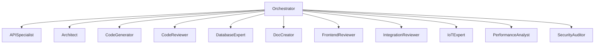

# AI Developer Agents


A production-ready suite of 14 specialized AI software engineering subagents for orchestrating complex development workflows. Each agent is a self-contained, markdown-defined prompt optimized for use in AI IDEs and chat tools.

## What is This?

Imagine you have a big software project to build—like a website, a mobile app, or a backend API. Normally, you'd need a whole team: an architect to design the system, a developer to write code, a tester to check for bugs, a security expert to lock it down, a DevOps engineer to deploy it, and more.

This repository gives you that entire team—as AI prompts you can load into tools like Cursor, Claude, or GitHub Copilot. Each "agent" is a specialized AI persona with expert knowledge in a specific domain. You talk to the **Orchestrator** (the team lead), and it automatically delegates tasks to the right specialists, then combines their work into a final result.

## Core Features

- **Orchestrator + Subagents Model**: A central Orchestrator decomposes tasks and dispatches them to specialized subagents, then synthesizes their outputs into a unified deliverable.
- **14 Specialized Agents**: Covering the full SDLC—architecture, implementation, testing, documentation, review, security, DevOps, performance, IoT, integration, and more.
- **IDE-Agnostic Prompts**: Markdown-based agent definitions load directly into Cursor, Claude, ChatGPT, GitHub Copilot, Windsurf, and similar tools.
- **CI Validation**: Automated linting and validation of agent definitions on every PR.
- **Extensible**: Add custom agents by following the established schema and conventions.

## How It Works — Simple Explanation

### What is an "Agent"?
An agent is a file (`.md`) that tells an AI tool how to behave in a specific role. It's like giving the AI a job description and expertise before it starts helping you. For example:
- The **Code Reviewer** agent knows how to spot bugs, security issues, and bad code patterns.
- The **Database Expert** agent knows how to design efficient database schemas.
- The **Security Auditor** agent knows how to find vulnerabilities and fix them.

### What is the "Orchestrator"?
The Orchestrator is the "project manager" agent. When you give it a big task like *"Build a REST API with authentication"*, it:
1. Breaks the task into smaller pieces (design, code, test, secure, deploy)
2. Sends each piece to the right specialist agent
3. Collects all the results
4. Combines them into a complete, working solution

### Why Use Multiple Agents?
Specialized AI agents produce better results than a single general-purpose AI because each agent has deep, focused expertise in its domain. Just like a real software team, specialists collaborate to build high-quality software.

## Architecture Overview

The system follows a **hub-and-spoke architecture**:



The **Orchestrator** receives high-level user tasks, decomposes them into discrete subtasks, dispatches each to the most appropriate agent, and synthesizes the results into a final deliverable. This enables complex, end-to-end workflows while maintaining specialization and quality.

## Agent Directory

| Filename | Role | Typical Input | Typical Output |
|----------|------|--------------|----------------|
| `orchestrator.md` | Central task coordinator and synthesizer | High-level task description | Integrated final deliverable with summary |
| `api_specialist.md` | Validates OpenAPI specs and API design | API endpoints, OpenAPI YAML/JSON | API assessment with consistency score and recommendations |
| `architecture_reviewer.md` | Evaluates system design, scalability, reliability | HLD/LLD, architecture diagrams | Assessment report with trade-offs and recommendations |
| `code_reviewer.md` | Reviews code for quality, bugs, and security | PR diffs, source code | Structured review with severity-ranked findings and fixes |
| `database_expert.md` | Designs schemas and optimizes queries | SQL schema, ORM models, query code | Schema definitions, migration scripts, index recommendations |
| `developer_agent.md` | Generates production-ready code implementations | Requirements, existing code examples | Production-ready code with design decisions and testing strategy |
| `devops_reviewer.md` | Reviews infrastructure, CI/CD, and deployments | Dockerfiles, K8s manifests, Terraform | Infrastructure maturity assessment with automation opportunities |
| `document_creator.md` | Generates HLD, LLD, and API specifications | Requirements, architecture notes | Structured technical documents with full traceability |
| `frontend_reviewer.md` | Reviews UI/UX, accessibility, and frontend code | HTML, CSS, JS/TS, React/Vue components | Frontend quality assessment with UX and accessibility findings |
| `integration_reviewer.md` | Reviews system integrations and middleware | Architecture diagrams, event schemas, integration code | Integration maturity assessment with coupling and observability analysis |
| `iot_protocol_specialist.md` | Reviews IoT architectures and protocol implementations | IoT architecture, MQTT/OPCUA/Modbus configs | Protocol analysis with edge processing and reliability recommendations |
| `performance_analyst.md` | Analyzes performance bottlenecks and scalability | Code, architecture, API implementations | Performance baselines, bottlenecks, and load testing scenarios |
| `security_auditor.md` | Audits security posture and compliance gaps | Architecture, code, deployment configs | Threat landscape, vulnerabilities, and prioritized remediations |
| `test_writer.md` | Generates comprehensive test scenarios and cases | Requirements, API specs, feature details | Test cases, edge cases, negative scenarios, and automation suggestions |

## Quickstart

### Step 1: Clone the Repository

```bash
git clone https://github.com/nimish-nirmal/ai-developer-agents.git
cd ai-developer-agents
```

### Step 2: Load Agents into Your IDE

Each agent is a standalone markdown file. Load them into your preferred AI tool:

#### Cursor
1. Open your project in Cursor.
2. Create a `.cursor/rules/` directory (if it doesn't exist).
3. Copy the desired agent `.md` files into `.cursor/rules/`.
4. Cursor will automatically detect and load these rules.

#### Claude Projects
1. Go to [Claude Projects](https://claude.ai/projects).
2. Create a new project.
3. Upload or paste the agent markdown files as project knowledge.
4. Select the appropriate agent as the system prompt for your conversation.

#### ChatGPT Custom GPTs
1. Go to [GPT Store](https://chat.openai.com/gpts) or create a Custom GPT.
2. In the "Instructions" field, paste the contents of the desired agent `.md` file.
3. Optionally upload supporting files from the `examples/` directory.

#### GitHub Copilot
1. In your repository, create a `.github/copilot-instructions.md` file.
2. Paste the agent system prompt content into this file.
3. Copilot will use this as project-wide context.

#### Windsurf
1. Open your project in Windsurf.
2. Navigate to `.windsurf/rules/`.
3. Place agent `.md` files there for automatic loading.

### Step 3: Run a Workflow

The Orchestrator agent is the entry point. Copy the contents of `agents/orchestrator.md` into your AI tool's system prompt or instructions, then provide your high-level task.

Example interaction:

```
User: Build a REST API for a task management app with authentication, tests, and documentation.

Orchestrator: I'll decompose this into subtasks and dispatch them to the appropriate agents...

[Dispatches to architecture-reviewer, api-specialist, developer-agent, database-expert, test-writer, document-creator, code-reviewer, security-auditor, devops-reviewer, performance-analyst]

Orchestrator: Here is the integrated final deliverable...
```

## Example End-to-End Workflow

### Input
> **User:** "Build a user authentication microservice with JWT, rate limiting, and PostgreSQL."

### Orchestrator Execution

1. **Decompose** the task:
   - Design microservice architecture (`architecture_reviewer`)
   - Validate API design (`api_specialist`)
   - Implement auth service (`developer_agent`)
   - Design database schema (`database_expert`)
   - Generate comprehensive tests (`test_writer`)
   - Create technical documentation (`document_creator`)
   - Review code quality (`code_reviewer`)
   - Audit security posture (`security_auditor`)
   - Review DevOps setup (`devops_reviewer`)
   - Analyze performance (`performance_analyst`)

2. **Dispatch & Aggregate**:
   - Architecture Reviewer designs the microservice boundaries and communication patterns.
   - API Specialist validates the REST endpoints and OpenAPI specification.
   - Developer Agent implements the auth service with JWT middleware and rate limiting.
   - Database Expert creates the `users`, `sessions`, and `refresh_tokens` tables with indexes.
   - Test Writer creates unit tests for auth logic and integration tests for the API.
   - Document Creator generates HLD/LLD docs and API specifications.
   - Code Reviewer evaluates code quality and suggests refactors.
   - Security Auditor identifies missing input validation and rate limit bypass risks.
   - DevOps Reviewer evaluates the Dockerfile and CI/CD pipeline.
   - Performance Analyst profiles the auth endpoint and recommends caching strategies.

3. **Synthesize**:
   - Orchestrator merges all outputs into a cohesive project.
   - Resolves any conflicting recommendations (e.g., database indexing vs. write performance).
   - Validates completeness against original requirements.

### Output
A complete, production-ready repository with:
- `src/` — Auth service implementation
- `migrations/` — Database schema and indexes
- `tests/` — Unit and integration tests
- `docs/` — HLD/LLD docs and API specifications
- `Dockerfile` — Containerized deployment
- `.github/workflows/` — CI/CD pipeline
- `SECURITY.md` — Security audit findings and remediations

## Validation

Run the validation script to ensure all agent files adhere to formatting guidelines:

```bash
python scripts/validate_agents.py
```

This checks:
- Legacy `SYSTEM PROMPT` format integrity
- Required sections (`Role`, `Task`, `Output Format`, `Input`)
- New YAML frontmatter format (if applicable)
- File completeness and non-emptiness

## Detailed Agent Reference

See [docs/agents.md](docs/agents.md) for a categorized breakdown of all agents with usage tips.

## Contribution Guidelines

We welcome contributions! Please see [CONTRIBUTING.md](CONTRIBUTING.md) for details on:
- Adding new agents
- Improving existing prompts
- Reporting bugs or requesting features

## License

This project is licensed under the MIT License. See [LICENSE](LICENSE) for details.
